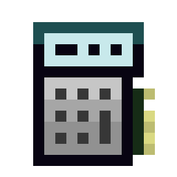

# GTNH-OC-Infusion-Control 

## Content

- [Information](#information)
- [How to use](#how-to-use)
- [Installation](#installation)
- [Setup](#setup)
- [Configuration](#configuration)

<a id="information"></a>

## Information

The program is designed to automate the process of crafting in Runic Matrix from the Thaumcraft mod. 
The program is able to order missing aspects for crafting. Unlike the Advanced Infusion Provider, 
my program will not allow you to start crafting until you have all the necessary aspects in AE. 
It is also possible to send messages to Discord about out of service situations.
And there is also the possibility of auto update at startup.

#### Controls

<kbd>Q</kbd> - Closing the program

<kbd>A</kbd> - Add new recipe (Work only in idle state)

<kbd>E</kbd> - Edit recipes (Work only in idle state)

<kbd>Delete</kbd> - Clear scroll list

<kbd>Arrow Up</kbd> - Scroll list up

<kbd>Arrow Down</kbd> - Scroll list down

#### Interface


<a id="installation"></a>

## How to use

<a id="how-to-use"></a>

#### How it works

The program looks at what ingredients are present in the Infusion AE subnet, finds if it is this recipe in the registered recipes.
After that it looks if there are enough aspects for crafting. If not, it tries to order the missing ones, if it fails, it gives an error. 
If all is enough, then starts infusion and after the expiration of the craft returns the result to the main AE.

#### Adding a recipe for aspect

Craft patterns on aspects are encoded with Distillation Pattern Encoder.


#### Adding a recipe

To use it, you must first add a recipe, which is done by coding the recipe in the ME Fluid Processing Pattern Terminal.

> [!NOTE]  
> ME Fluid Processing Pattern Terminal can be obtained on the IV there is to make a Universal Wireless Terminal.

With the ME Fluid Processing Pattern Terminal open, find the recipe you are interested in in NEI and shifty-click [+].


You should then have a recipe appear in the ME Fluid Processing Pattern Terminal, where the first ingredient will be the 
ingredient from the center pedestal and at the end will be the required aspects on the recipe. You will need to code it.

> [!NOTE]  
> If you don't have the first ingredient in the recipe from the center pedestal or you don't have aspects added to the recipe, 
> my program won't be able to craft everything correctly.

> [!CAUTION]
> Due to the peculiarities of OC, there should not be any aspect ratio greater than 127 in the recipe, the program will generate an error. 
> To avoid it, manually reduce the amount of aspect below 127. Then at the moment of adding change it to the required amount.


Once you have coded the template, put it in the interface to add a new recipe.


Then open the monitor and when the program is in idle state press the key <kbd>A</kbd>.
After that the program will start searching for new recipes.


Then confirm that you want to add a new recipe.


Then edit the desired aspects if you need to.


Once the recipe is registered, move the template from the add interface, to the recipe interface.
The program itself is removed from the aspects template.


#### Editing a recipe

Editing is very simple, if you coded the wrong ingredient into the template or got the number of aspects wrong, 
you need to delete it and add it again. To do this when the program is in idle mode press <kbd>E</kbd> to enter edit mode. 
If you have many recipes, it may be that it is not on the first page. Then enter the index of the recipe you are interested 
in and delete it. Then repeat the process of adding a recipe.


## Installation

> [!CAUTION]
> If you are using 8 java, the installer will not work for you. 
> The only way to install the program is to manually transfer it to your computer.
> The problem is on the java side.

To install program, you need a computer with:
- Graphics Card (Tier 3): 1
- Central Processing Unit (CPU) (Tier 3): 1
- Memory (Tier 3.5): 2
- Hard Disk Drive (Tier 3) (4MB): 1
- EEPROM (Lua BIOS): 1
- Internet Card: 1


Install the basic Open OS on your computer.
Then run the command to start the installer.

```shell
pastebin run ESUAMAGx
``` 

Or

```shell
wget -f https://raw.githubusercontent.com/Navatusein/GTNH-OC-Installer/main/installer.lua && installer
``` 

Then select the Infusion Control program in the installer.
If you wish you can add the program to auto download, for manual start write a command.

```shell
main
```

> [!NOTE]  
> For convenient configuration you can use the web configurator.
> [GTNH-OC-Web-Configurator](https://navatusein.github.io/GTNH-OC-Web-Configurator/#/configurator?url=https%3A%2F%2Fraw.githubusercontent.com%2FNavatusein%2FGTNH-OC-Infusion-Control%2Fmain%2Fconfig-descriptor.yml)

<a id="setup"></a>

## Setup

> [!NOTE]  
> For easy copying of addresses, use "Analyzer" from the OpenComputers mod. Right-click on the component, its address will be written in the chat. 
> If you click on it, it will be copied.
>
> 

<br/>

To build a setup, you will need:

- Transposer: 1
- Adapter: 2
- Redstone I/O: 1
- Database: 1

The construction of the set-up will start with the Runic Matrix. 
The location of Arcane Pedestals does not matter, you can place them as you like. 
I have arranged them in a circle with a radius of 6 blocks.


All Arcane Pedestals must be connected to the Infusion AE subnet (It is red in the pictures). 

> [!NOTE]  
> The center Arcane Pedestal should be set at priority 1, all others at priority 0.


Also, Infusion AE subnet has ME IO Port and interface to connect to OC. 
Additionally, in the picture you can see the 
ME IO Port which is connected to the Main AE (It is green in the picture).


The part with the main AE looks like this. Ingredients are transferred to the 
Infusion AE subnetwork in the same way as in the Assembly Line. 
I also pass power to World Accelerators and vis to Infusion Claw through the main AE.


The part with OC components looks like this. It consists of an adapter connected to the interface for 
adding new recipes. It is connected through the adapter. This interface is also used for OC access to the 
main AE. This interface is connected to the main AE through the Computer Case block. The next component is 
a transposer, which is needed to move the cell between the ME IO Port. The next adapter is connected to the 
Infusion AE subnet interface. It is needed to read items on this subnet. The last component is the Redstone 
IO which outputs a redstone signal to the Redstone Transmitter (External) to control the World Accelerators 
and Infusion Claw. You should also put any tier database in one of the adapters.


Two World Accelerators are installed next to the matrix and Infusion Claw. On the side of the 
World Accelerators that faces the Infusion Claw, install a Redstone Receiver (External) and 
set it to a frequency for example 1. Then on the World Accelerator which is paid to Infusion Claw 
it is necessary to install Redstone Receiver (Internal) with frequency for example 2. 
And on the World Accelerator, which stands close to the matrix, it is necessary to set Redstone Receiver (Internal) 
with frequency for example 3.


In a circle from Redstone IO we put 3 any frame on which we need to install 1 Redstone Transmitter (External) on the 
side that is directed to Redstone IO. We need to set them in order to the same frequencies as we specified in the 
previous step. Later on in `config.lua` you will need to specify on which side of Redstone IO there is a Redstone 
Transmitter (External) which is set to the frequency of for example Redstone Receiver (External) which is at 
Infusion Claw.


<a id="configuration"></a>

## Configuration

> [!NOTE]  
> For convenient configuration you can use the web configurator.
> [GTNH-OC-Web-Configurator](https://navatusein.github.io/GTNH-OC-Web-Configurator/#/configurator?url=https%3A%2F%2Fraw.githubusercontent.com%2FNavatusein%2FGTNH-OC-Infusion-Control%2Fmain%2Fconfig-descriptor.yml)

General configuration in file `config.lua`

Enable auto update when starting the program.

```lua
enableAutoUpdate = true, -- Enable auto update on start
```

In the `timeZone` field you can specify your time zone.

In the `discordWebhookUrl` field, you can specify the Discord Webhook link so that the program sends messages to the discord about emergency situations.
[How to Create a Discord Webhook?](https://www.svix.com/resources/guides/how-to-make-webhook-discord/)

```lua
logger = loggerLib:newFormConfig({
  name = "Infusion Control",
  timeZone = 3, -- Your time zone
  handlers = {
    discordLoggerHandler:newFormConfig({
      logLevel = "warning",
      messageFormat = "{Time:%d.%m.%Y %H:%M:%S} [{LogLevel}]: {Message}",
      discordWebhookUrl = "" -- Discord Webhook URL
    }),
    fileLoggerHandler:newFormConfig({
      logLevel = "info",
      messageFormat = "{Time:%d.%m.%Y %H:%M:%S} [{LogLevel}]: {Message}",
      filePath = "logs.log"
    }),
    scrollListLoggerHandler:newFormConfig({
      logLevel = "info",
      logsListSize = 32
    }),
  }
}),
```

In the `maxCpuUse` field you specify number of CPUs that can be used to order aspects

```lua
maxCpuUse = 3, -- Number of CPUs that can be used to order aspects
```

In the `mainMeInterfaceAddress` field address of the me interface which connected to main ME (In the example, this is the same interface used to add a new recipe )

```lua
essentiaManager = essentiaManager:newFormConfig({
  mainMeInterfaceAddress = "aaaaaaaa-aaaa-aaaa-aaaa-aaaaaaaaaaaa" -- Address of the me interface which connected to main ME
}),
```

In the `infusionMeInterfaceAddress` field you specify address of the me interface which connected to infusion ME

In the `transposerAddress` field you specify address of the transposer which is between the two ME IO ports

In the `mainMeSide` field you specify side of the transposer with ME IO Port which connected to main ME

In the `infusionMeSide` field you specify side of the transposer with ME IO Port which connected to infusion ME

In the `redstoneAddress` field you specify address of the Redstone I/O

In the `infusionClawSide` field you specify side of the Redstone I/O with Redstone Transmitter of the infusion claw

In the `infusionClawAcceleratorSide` field you specify side of the Redstone I/O with Redstone Transmitter of the infusion claw accelerator

In the `acceleratorSide` field you specify side of the Redstone I/O with Redstone Transmitter of the matrix accelerator

In the `infusionClawActivationDelay` field you specify delay how long to signal the infusion claw

In the `infusionClawAcceleratorDelay` field you specify delay how long to signal the infusion claw accelerator

> [!CAUTION]
> `infusionClawActivationDelay` and `infusionClawAcceleratorDelay` are different for different tiers of World Accelerator.
>
> For example, for Advanced World Accelerator III, `infusionClawActivationDelay = 0.5` and `infusionClawAcceleratorDelay = 2` 
> so you need to match if the scheme is not consistently starting the infusion.

```lua
infusionManager = infusionManager:newFormConfig({
  infusionMeInterfaceAddress = "aaaaaaaa-aaaa-aaaa-aaaa-aaaaaaaaaaaa", -- Address of the me interface which connected to infusion ME

  transposerAddress = "aaaaaaaa-aaaa-aaaa-aaaa-aaaaaaaaaaaa", -- Address of the transposer

  mainMeSide = sides.south, -- Side of the transposer with ME IO Port which connected to main ME
  infusionMeSide = sides.north, -- Side of the transposer with ME IO Port which connected to infusion ME

  redstoneAddress = "aaaaaaaa-aaaa-aaaa-aaaa-aaaaaaaaaaaa", -- Address of the Redstone I/O

  infusionClawSide = sides.west, -- Side of the Redstone I/O with Redstone Transmitter of the infusion claw
  infusionClawAcceleratorSide = sides.south, -- Side of the Redstone I/O with Redstone Transmitter of the infusion claw accelerator
  acceleratorSide = sides.north, -- Side of the Redstone I/O with Redstone Transmitter of the matrix accelerator

  infusionClawActivationDelay = 0.1, -- Delay how long to signal the infusion claw
  infusionClawAcceleratorDelay = 1, -- Delay how long to signal the infusion claw accelerator
}),
```

In the `recipeMeInterfaceAddress` field you specify address of me interface which will be used to add recipes

```lua
recipeManager = recipeManager:newFormConfig({
  recipeMeInterfaceAddress = "aaaaaaaa-aaaa-aaaa-aaaa-aaaaaaaaaaaa" -- Address of me interface which will be used to add recipes
}),
```